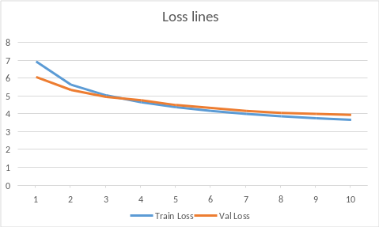
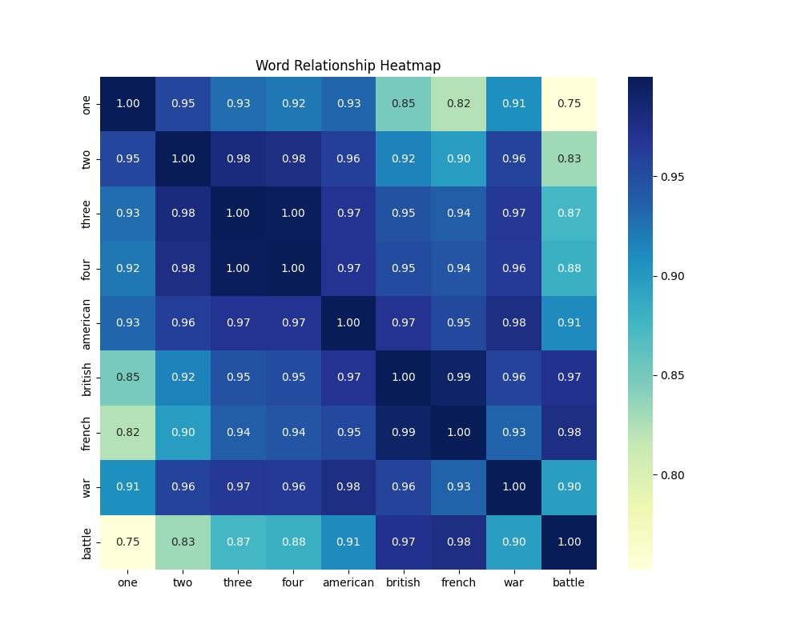

# Word2Vec Implementation in NumPy
This repository contains a simple implementation of the Word2Vec algorithm using NumPy. 

The goal was to create a basic version of Word2Vec without the use of any deep learning frameworks.

## Files

This repository includes the following files:
- train.py: This includes the train loop for training the Word2Vec model.
- test.py: This includes the tests for evaluating the trained Word2Vec model.
- data.py: This includes the DataLoader to be used in the training loop.
- model.py: This includes the actual Word2Vec model.

## Usage
To train the Word2Vec model, run the following command:
`python3 train.py`

## Dataset

I used the text8 dataset for training the Word2Vec model. The text8 dataset is a preprocessed version of the Wikipedia dump and contains 100MB of text data.
I only used the first 800000 words in order to make training faster.

## Training


I trained the model for 10 epochs with a lr of 0.003. These hyperparameters were chosen by hand, since perfect performance wasn't the main goal of the project.




## Results

After training the model and running all the tests I obtained the following results:

This is a heatmap showing the cosine similarity between the words in the test set. You can see how the first 5 and last 5 words are similar to each other. 
That's why the heatmap shows 2 blocks of high similarity, one in the top left corner and one in the bottom right corner. However words from different blocks do not obtain high similarity.




```
>>> Vector Logic:
Arithmetic: (seven - six) + eight = four (0.9889)
Arithmetic: (history - war) + peace = surrender (0.8873)
Arithmetic: (father - man) + woman = gift (0.9063)
```

You can see that it correctly guesses the second test.
However some results are just wrong, like the first and last tests. The first one you can at least see that the word most similar is a number. 
Chances are high that the correct number was 2nd or 3rd in the list.

```
Intruder Test: ['seven', 'eight', 'nine', 'war']
  -> Predicted Intruder: 'war' (Sim to group: 0.9734)
```


The model was able to identtify which word didn't belong in the list correctly.


## Conclusion


All in all I think the model learned correctly and these are convincing results. They are not perfect by any means; training for longer and with a bigger dataset would definitely improve the results. However, I think this is a good starting point for a simple Word2Vec implementation in NumPy. 
Training took a long time since it's running on CPU.
